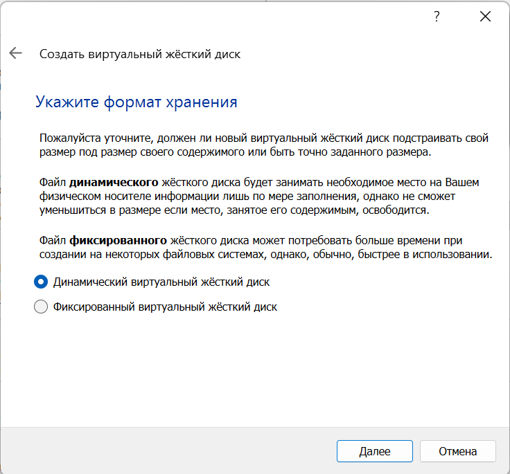
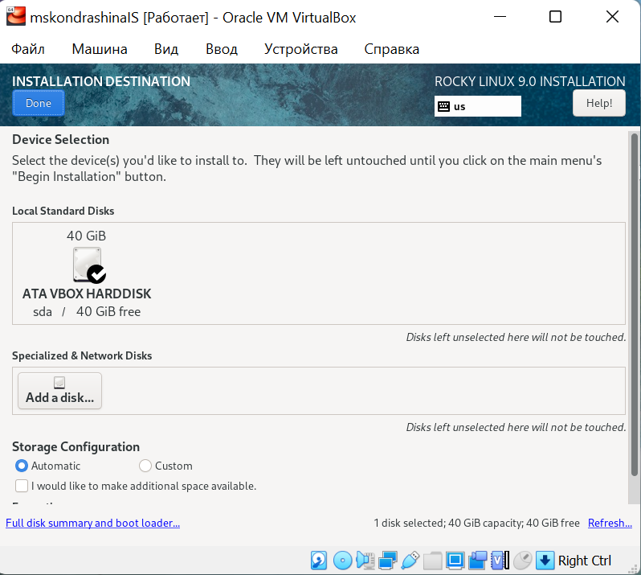
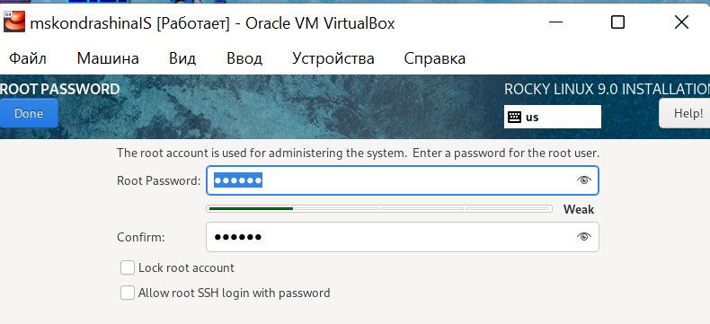
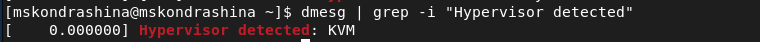

---
# Front matter
title: "Отчёт по лабораторной работе №1"
subtitle: "Установка и конфигурация операционной системы на виртуальную машину"
author: "Кондрашина Мария Сергеевна"

# Generic otions
lang: ru-RU
toc-title: "Содержание"

# Pdf output format
toc: true # Table of contents
toc_depth: 2
lof: true # List of figures
lot: true # List of tables
fontsize: 12pt
linestretch: 1.5
papersize: a4
documentclass: scrreprt
## I18n
polyglossia-lang:
  name: russian
  options:
	- spelling=modern
	- babelshorthands=true
polyglossia-otherlangs:
  name: english
### Fonts
mainfont: PT Serif
romanfont: PT Serif
sansfont: PT Sans
monofont: PT Mono
mainfontoptions: Ligatures=TeX
romanfontoptions: Ligatures=TeX
sansfontoptions: Ligatures=TeX,Scale=MatchLowercase
monofontoptions: Scale=MatchLowercase,Scale=0.9
## Biblatex
biblatex: true
biblio-style: "gost-numeric"
biblatexoptions:
  - parentracker=true
  - backend=biber
  - hyperref=auto
  - language=auto
  - autolang=other*
  - citestyle=gost-numeric
## Misc options
indent: true
header-includes:
  - \linepenalty=10 # the penalty added to the badness of each line within a paragraph (no associated penalty node) Increasing the value makes tex try to have fewer lines in the paragraph.
  - \interlinepenalty=0 # value of the penalty (node) added after each line of a paragraph.
  - \hyphenpenalty=50 # the penalty for line breaking at an automatically inserted hyphen
  - \exhyphenpenalty=50 # the penalty for line breaking at an explicit hyphen
  - \binoppenalty=700 # the penalty for breaking a line at a binary operator
  - \relpenalty=500 # the penalty for breaking a line at a relation
  - \clubpenalty=150 # extra penalty for breaking after first line of a paragraph
  - \widowpenalty=150 # extra penalty for breaking before last line of a paragraph
  - \displaywidowpenalty=50 # extra penalty for breaking before last line before a display math
  - \brokenpenalty=100 # extra penalty for page breaking after a hyphenated line
  - \predisplaypenalty=10000 # penalty for breaking before a display
  - \postdisplaypenalty=0 # penalty for breaking after a display
  - \floatingpenalty = 20000 # penalty for splitting an insertion (can only be split footnote in standard LaTeX)
  - \raggedbottom # or \flushbottom
  - \usepackage{float} # keep figures where there are in the text
  - \floatplacement{figure}{H} # keep figures where there are in the text
---

# Цель работы

Целью данной работы является приобретение практических навыков установки операционной системы на виртуальную машину, настройки минимально необходимых для дальнейшей работы сервисов.

# Выполнение лабораторной работы

1. Окно «Имя машины и тип ОС»

{ #fig:001 width=100%}

2.  Окно «Размер основной памяти»

{ #fig:002 width=100%}

3. Окно подключения или создания жёсткого диска на виртуальной машине

{ #fig:003 width=100%}

4.  Окно определения типа подключения виртуального жёсткого диска

{ #fig:004 width=100%}

5. Окно определения формата виртуального жёсткого диска

{ #fig:005 width=100%}

6. Окно определения размера виртуального динамического жёсткого
диска и его расположения

{ #fig:006 width=100%}

7.  Окно «Носители» виртуальной машины: подключение образа оптического диска

{ #fig:007 width=100%}

8. Носители виртуальной машины

{ #fig:008 width=100%}

9. Запуск виртуальной машины

{ #fig:009 width=100%}

10. Установка английского языка интерфейса ОС

{ #fig:010 width=100%}

11. Добавление русского языка, но в качестве языка по умолчанию
указан английский язык; задана комбинация клавиш для переключения
между раскладками клавиатуры (Alt_Shift)

{ #fig:011 width=100%}

12. Окно настройки установки: выбор программ

{ #fig:012 width=100%}

13. Окно настройки установки: место установки

{ #fig:013 width=100%}

14. Окно настройки установки: сеть и имя узла

{ #fig:014 width=100%}

15. Установка пароля для root

{ #fig:015 width=100%}

16. Установка пароля для пользователя с правами администратора

{ #fig:016 width=100%}

17. Завершение установки ОС

{ #fig:017 width=100%}

# Домашнее задание

1. Выполнение команды dmesg

{ #fig:018 width=100%}

2. Выполнение команды dmesg | less

{ #fig:019 width=100%}

{ #fig:020 width=100%}

Получение следующей информации:

1. Версия ядра Linux (Linux version).

{ #fig:021 width=100%}

2. Частота процессора (Detected Mhz processor). Частота 1992.003 MHz.

{ #fig:022 width=100%}

3. Модель процессора (CPU0).

{ #fig:023 width=100%}

4. Объем доступной оперативной памяти (Memory available). 260860/2096696K доступно.

{ #fig:024 width=100%}

5. Тип обнаруженного гипервизора (Hypervisor detected). Тип - KVM.

{ #fig:025 width=100%}

6. Тип файловой системы корневого раздела. Вывожу все файловые системы при помощи команды df -Th. Тип файловой системы корневого раздела - xfs.

{ #fig:026 width=100%}

1. Последовательность монтирования файловых систем. Для вывода использовала команду findmnt.

{ #fig:027 width=100%}

# Выводы

Выполнила лабораторную работу №1. Приобрела практические навыки
установки операционной системы на виртуальную машину, настройки минимально необходимых для дальнейшей работы сервисов.

# Список литературы

1. Методические материалы курса. "Информационная безопасность компьютерных сетей" Кулябов Д. С., Королькова А. В., Геворкян М. Н.