---
## Front matter
lang: ru-RU
title: Лабораторная работа №1
author: |
	Кондрашина Мария Сергеевна\inst{1}
institute: |
	\inst{1}RUDN University, Moscow, Russian Federation
date: 08.09.2022, Moscow

## Formatting
toc: false
slide_level: 2
theme: metropolis
header-includes: 
 - \metroset{progressbar=frametitle,sectionpage=progressbar,numbering=fraction}
 - '\makeatletter'
 - '\beamer@ignorenonframefalse'
 - '\makeatother'
aspectratio: 43
section-titles: true
---  

# Установка и конфигурация операционной системы на виртуальную машину

## Цель работы

- Приобрести практические навыки установки операционной системы на виртуальную машину, настройки минимально необходимых для дальнейшей работы сервисов.
- Выполнить лабораторную работу №1 и сделать по ней отчет.

# Выполнение лабораторной работы

## Окно «Имя машины и тип ОС»

{ #fig:001 width=100%}

## Окно «Размер основной памяти»

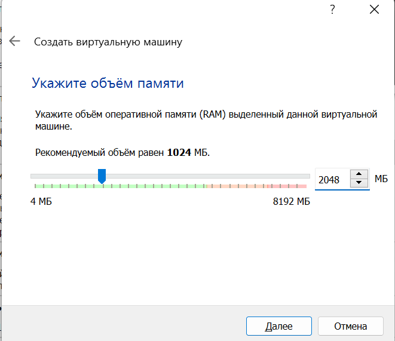{ #fig:002 width=100%}

## Окно подключения или создания жёсткого диска на виртуальной машине

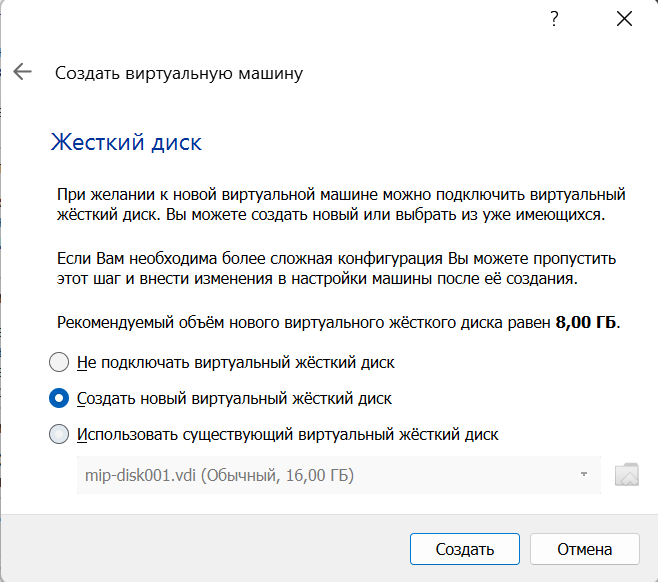{ #fig:003 width=100%}

## Окно определения типа подключения виртуального жёсткого диска

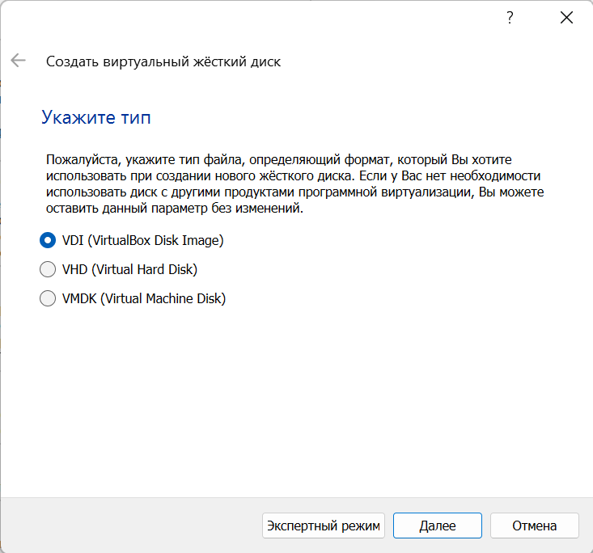{ #fig:004 width=100%}

## Окно определения формата виртуального жёсткого диска

{ #fig:005 width=100%}

## Окно определения размера виртуального динамического жёсткого диска и его расположения

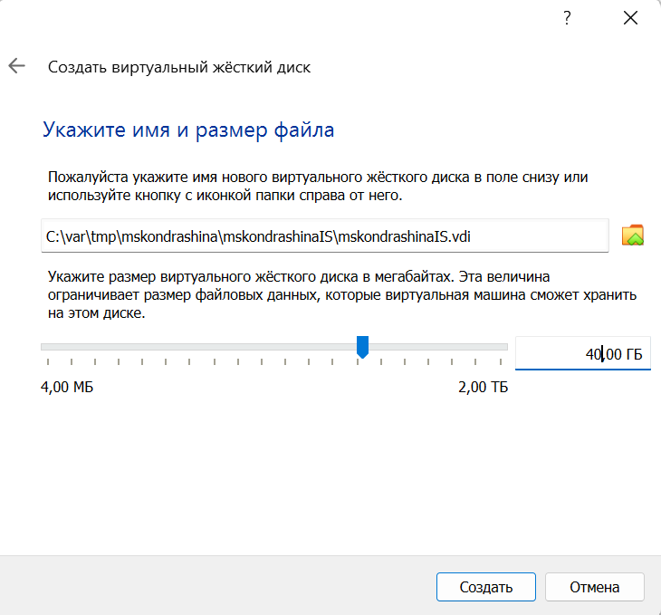{ #fig:006 width=100%}

## Окно «Носители» виртуальной машины: подключение образа оптического диска

{ #fig:007 width=100%}

## Носители виртуальной машины

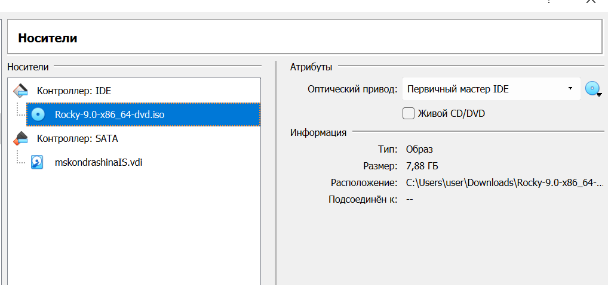{ #fig:008 width=100%}

## Запуск виртуальной машины

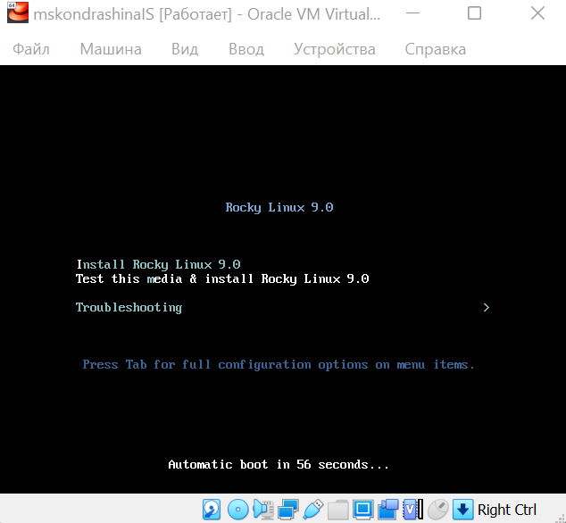{ #fig:009 width=100%}

## Установка английского языка интерфейса ОС

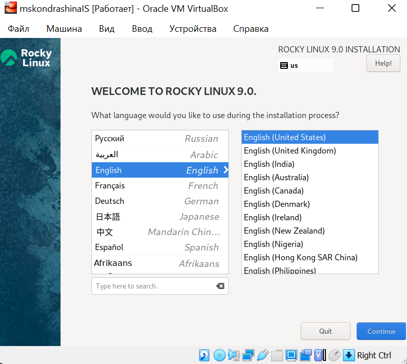{ #fig:010 width=100%}

## Добавление русского языка, но в качестве языка по умолчанию указан английский язык; задана комбинация клавиш для переключения между раскладками клавиатуры (Alt_Shift)

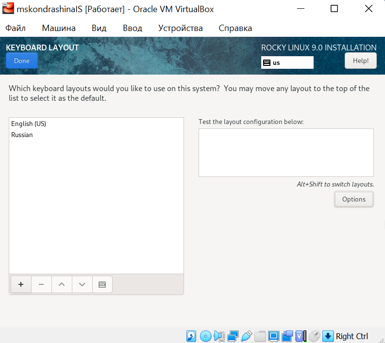{ #fig:011 width=100%}

## Окно настройки установки: выбор программ

{ #fig:012 width=100%}

## Окно настройки установки: место установки

{ #fig:013 width=100%}

## Окно настройки установки: сеть и имя узла

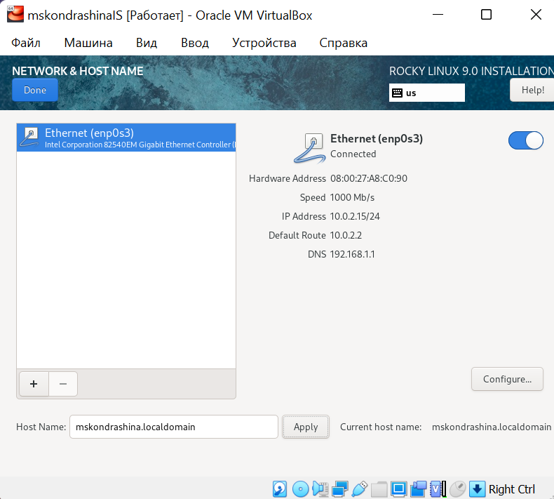{ #fig:014 width=100%}

## Установка пароля для root

{ #fig:015 width=100%}

## Установка пароля для пользователя с правами администратора

{ #fig:016 width=100%}

## Завершение установки ОС

{ #fig:017 width=100%}

# Домашнее задание

## Выполнение команды dmesg

{ #fig:018 width=100%}

## Выполнение команды dmesg | less

{ #fig:019 width=100%}

##

{ #fig:020 width=100%}

## Получение следующей информации:

1. Версия ядра Linux (Linux version).
2. Частота процессора (Detected Mhz processor).
3. Модель процессора (CPU0).
4. Объем доступной оперативной памяти (Memory available).
5. Тип обнаруженного гипервизора (Hypervisor detected).
6. Тип файловой системы корневого раздела.
7. Последовательность монтирования файловых систем.

## Версия ядра Linux (Linux version).

{ #fig:021 width=100%}

## Частота процессора (Detected Mhz processor). Частота 1992.003 MHz.

{ #fig:022 width=100%}

## Модель процессора (CPU0).

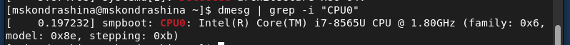{ #fig:023 width=100%}

## Объем доступной оперативной памяти (Memory available). 260860/2096696K доступно.

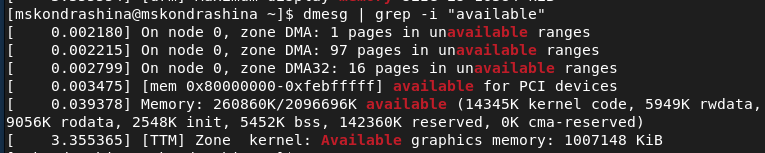{ #fig:024 width=100%}

## Тип обнаруженного гипервизора (Hypervisor detected). Тип - KVM.

{ #fig:025 width=100%}

## Тип файловой системы корневого раздела. Вывожу все файловые системы при помощи команды df -Th. Тип файловой системы корневого раздела - xfs.

{ #fig:026 width=100%}

## Последовательность монтирования файловых систем. Для вывода использовала команду findmnt.

{ #fig:027 width=100%}

## Результат

- Выполнила лабораторную работу №1.
- Приобрела практические навыки установки операционной системы на виртуальную машину, настройки минимально необходимых для дальнейшей работы сервисов.

## Список литературы

1. Методические материалы курса. "Информационная безопасность компьютерных сетей" Кулябов Д. С., Королькова А. В., Геворкян М. Н.